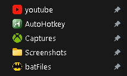

# Folder Icon Setter

This is a **Windows 11 batch script (.bat)** that allows you to change folder icons by applying a custom `.ico` file using a `desktop.ini` configuration.  
It automates the process of assigning custom icons to folders, sets the required attributes, and refreshes File Explorer so the new icon appears immediately.

You can use this to **visually organize folders** by applying personalized icons with minimal effort.

> ⚠️ **Important:** This script **must be run as Administrator**. Right-click the `.bat` file and choose **"Run as administrator"**.

## ✅ Features
- Applies custom icon via `desktop.ini`
- Automatically sets required folder attributes (`+s +r`)
- Hides `desktop.ini` after creation
- Restarts Windows Explorer to reflect changes
- Opens `desktop.ini` for manual verification (with Admin rights)

## 🛠 How to Use

1. **Edit the Script:**

   Replace these two lines in the script with your actual paths:
   ```bat
   set folder=FULL_PATH_TO_TARGET_FOLDER
   set icon=FULL_PATH_TO_ICON_FILE.ico
    ```
2. **Save the Script as a `.bat` File:**

   Open Notepad, paste the script, and save it with a `.bat` extension (e.g., `set_folder_icon.bat`).  
   Be sure to select **"All Files"** as the file type when saving.

3. **Run the Script as Administrator:**

   Right-click the saved `.bat` file and choose **"Run as administrator"**.  
   This is required to modify system attributes and restart Explorer.

4. **Verify the Icon and Configuration:**

   The script will automatically open the `desktop.ini` file in Notepad (as Administrator).  
   Confirm it contains the correct icon path:
   ```ini
   [.ShellClassInfo]
   IconResource=FULL_PATH_TO_ICON_FILE.ico,0
    ```

## 📁 Example

```bat
set folder=C:\Users\YourName\Documents\MyFolder
set icon=D:\icoFiles\customIcon.ico
```

**Explanation:**

- `set folder=...` is the full path to the folder where you want to apply the new icon.
- `set icon=...` is the path to your `.ico` file (the custom icon you want to use).

When you run the script with these paths:

- It deletes any old icon setting (`desktop.ini`) from the folder.
- Writes a new `desktop.ini` file that tells Windows to use your `.ico` file.
- Applies required attributes so Windows respects the settings.
- Restarts File Explorer so the change shows right away.
- Opens `desktop.ini` in Notepad (as Admin) so you can check that everything looks correct.

**Visual Example:**



All folders shown have been updated with custom icons using this script,  
except for the **Screenshots** folder which still has the default icon.

## 🔐 Permissions and Limitations
- **Requires Admin Rights:** Script must be run as Administrator to change folder attributes and restart Explorer.
- **Only Works on Folders:** Cannot be used to set icons for drives or individual files.
- **Supports `.ico` only:** `.png`, `.jpg`, or `.dll` icon references will not work.

## 📌 Notes

- Store `.ico` files **outside of OneDrive** to avoid sync issues or broken icon references.
- Use **absolute paths** for both `folder` and `icon` to ensure the script works reliably.
- If the icon does not appear immediately, ensure:
  - The folder was not open in File Explorer while the script ran.
  - The `.ico` file path is valid and accessible.
  - The `desktop.ini` was correctly written (opened at the end of the script).
- This script modifies folder attributes and restarts Explorer — always run it with **Administrator privileges**.

## ❓ Troubleshooting

### Icon Didn't Change
- **Check if the folder was open in Explorer** when the script ran. Close it and re-run the script.
- **Ensure the `.ico` file exists** and the path is correct.
- **Verify `desktop.ini` content** by checking that it includes:
  ```ini
  [.ShellClassInfo]
  IconResource=FULL_PATH_TO_ICON_FILE.ico,0
  ```
**Run the script as Administrator.** If not, some changes (like Explorer restart or file attribute updates) may fail.

### Icon Resets After Reboot

- **Strongly recommended:** Keep your `.ico` files in a permanent folder **outside of OneDrive** (e.g., `D:\icoFiles`) to prevent sync issues or missing icons after reboot.
- Verify the folder still has `+s` (system) and `+r` (read-only) attributes:
  
  ```cmd
  attrib "FULL_PATH_TO_TARGET_FOLDER"
  ```

### desktop.ini Doesn't Show

- Enable hidden files and system files in File Explorer view settings.
- Or, open it directly via Command Prompt:

  ```cmd
  notepad "FULL_PATH_TO_TARGET_FOLDER\desktop.ini"
  ```

### Still Not Working?

- Try clearing the icon cache:

  ```cmd
  ie4uinit.exe -ClearIconCache
  ```

- Then restart Explorer again:

  ```cmd
  taskkill /f /im explorer.exe
  start explorer.exe
  ```

## License

[](https://opensource.org/licenses/MIT)

This project is licensed under the MIT License. See the [LICENSE](LICENSE) file for details.

## Contact

For questions or feedback, reach out via email:
- **Email**: jred8069@gmail.com
